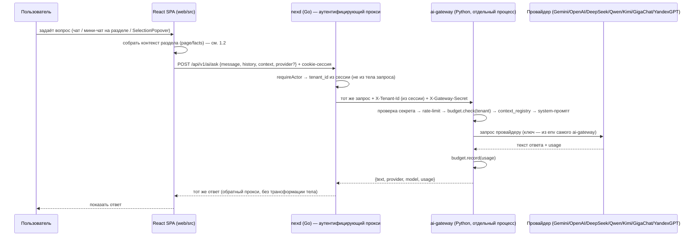
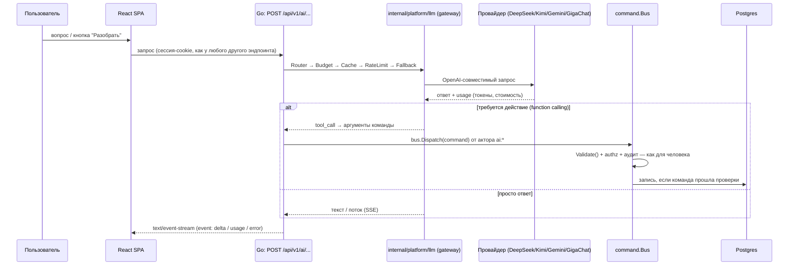

# AI-архитектура NEX: что работает сейчас и что запланировано

Этот файл — тот самый `docs/ai/`, на который уже ссылается
`docs/go-guide.md` (§18: *«Полная стратегия — `docs/ai/` и
`docs/research/ai-core.md`»*), но который до сих пор не существовал.
`docs/research/ai-core.md` пока не написан — этот документ его не
заменяет, а закрывает верхнеуровневый пробел.

Парный документ про Go-архитектуру в целом — `docs/architecture-go.md`.

**Важно сразу разделить два слоя, которые легко перепутать:**

| | Статус | Где живёт | Технология |
|---|---|---|---|
| **Сегодня** | Реально работает | `ai-gateway/` (отдельный сервис) за прокси `nexd` + фронтенд как клиент `nexd` | Python (FastAPI) — шлюз; Go (`nexd`) — аутентифицирующий прокси; TypeScript/React — клиент, вызывающий только `nexd` |
| **План (roadmap)** | Спроектировано, не реализовано | Go-бэкенд | `internal/platform/llm` (пакет пока не существует — сам вызов провайдеров всё ещё в Python) |

Это описание уже НЕ совпадает с более ранней версией этого документа:
раньше фронтенд ходил прямой `fetch()` в Gemini/OpenAI-совместимый API
из браузера, а ключи лежали в `localStorage`; затем — прямой `fetch()`
в `ai-gateway`, минуя `nexd` (ключей провайдеров это уже не касалось, но
`ai-gateway` доверял заголовку `X-Tenant-Id` от кого угодно). Оба этапа
исправлены — подробности в разделе 1. Целевая архитектура на Go
(`internal/platform/llm`, раздел 2), где сам вызов провайдеров тоже
переезжает в Go, при этом остаётся планом.

## 1. Как это устроено сегодня

Все вызовы LLM идут через отдельный сервис **`ai-gateway/`** (Python,
FastAPI, см. [`ai-gateway/README.md`](../../ai-gateway/README.md)) — но
фронтенд больше не обращается к нему напрямую. Браузер ходит **только в
`nexd`** (тот же origin и та же cookie-сессия, что и весь остальной
`/api/v1/*`), а `nexd` сам проксирует `/api/v1/ai/*` в `ai-gateway` по
внутренней сети (`internal/platform/httpapi/aiproxy.go`), подставляя
`tenant_id` из аутентифицированного актора и подписывая запрос
секретом, общим с `ai-gateway` (`NEX_AI_GATEWAY_SECRET`). Раньше
(браузер → `ai-gateway` напрямую) `X-Tenant-Id` был самопредставлением
клиента: кто угодно, достучавшись до шлюза, мог вписать туда чужого
тенанта и обойти его бюджет — см. `ai-gateway/app/deps.py:verify_gateway_secret`.

```ts
// web/src/llm.ts
// Конфигурация — VITE_AI_ENABLED (флаг, НЕ url — см. .env.example):
//   • не "1"/"true" → демо-режим: ИИ выключен, все точки входа сами
//     откатываются на локальный мок (nexReply/fallback), сеть не трогаем;
//   • "1"/"true"     → реальные вызовы через nexd → ai-gateway.
```

Ключи провайдеров (`GEMINI_API_KEY`, `OPENAI_API_KEY`, ...) живут ТОЛЬКО
в переменных окружения `ai-gateway` (см. `ai-gateway/.env.example`) — ни
один секрет не попадает ни в код, ни в браузер, ни в git.

### 1.1 Диаграмма текущего потока



`nexd` (Go) участвует в каждом AI-запросе как прокси — единственное, что
он делает, это аутентифицирует запрос и подставляет проверенный
`tenant_id`; сам вызов LLM-провайдера по-прежнему делает `ai-gateway`.
Это отличается от плана в разделе 2 (`internal/platform/llm`), где Go
сам ходил бы к провайдерам, без Python-прослойки вообще.

### 1.2 Контекст страницы: как мини-чат понимает, где он открыт

Раньше каждая страница с мини-чатом (`<AiBox>`) сама формулировала
системный промпт строкой прямо в JSX (например, «Ты — финансовый
аналитик колледжа...» в `web/src/pages/operations.tsx`). Это работало,
но роль ассистента была разбросана по компонентам и не переиспользовалась.

Теперь фронтенд посылает **структуру**, а не готовый текст промпта:

```ts
// web/src/llm.ts — интерфейс PageContext
export interface PageContext {
  page: string;       // идентификатор раздела, напр. "finance" (см. nexbrain.ts:PAGE_TITLES)
  title?: string;      // человекочитаемое имя мини-чата
  facts?: string[];    // короткие ЖИВЫЕ данные экрана — не роль, а данные
  state?: string;      // произвольное краткое описание состояния экрана
}
```

На сервере `ai-gateway/app/core/context_registry.py` хранит реестр
system-инструкций по разделам (`SECTION_PROMPTS`) — «ты помощник
приёмной комиссии», «ты финансовый аналитик» и т.п. — версионируется в
git, в одном месте. `ai_service.py` собирает финальный промпт:

```
DEFAULT_SYSTEM_PROMPT + инструкция_раздела(context.page) + context.facts + context.state
```

Явный `system` в запросе (если передан) полностью ПЕРЕОПРЕДЕЛЯЕТ этот
механизм — так работает главный чат NEX (`Chat.tsx`), у которого одна
большая личность `ORG_CONTEXT`, не привязанная к одному разделу.

**Память диалога — своя на каждый раздел.** `web/src/pages/aibox.tsx` и
`web/src/ai.tsx` (`InlinePanel`) хранят историю сообщений в
`sessionStorage`, ключ — идентификатор раздела (`nex-ai-hist:<page>` /
`nex-ai-inline-hist:<page>`, либо `student:<id>` для досье студента).
Открыли мини-чат в «Финансах» — своя ветка; открыли в «Приёме» — другая,
они не смешиваются, даже если открыты в одной вкладке браузера.

### 1.3 Провайдеры

`ai-gateway` умеет говорить с 8 провайдерами через единый интерфейс
`LLMProvider` (`ai-gateway/app/providers/base.py`) — подробная таблица
и статус «проверено ли живьём» — в
[`ai-gateway/README.md`, разделе «Провайдеры»](../../ai-gateway/README.md#провайдеры).
Коротко: `gemini`/`custom`/`openai`/`deepseek`/`qwen`/`kimi` — через
параметризованный `OpenAICompatProvider` (все OpenAI-совместимы);
`gigachat` и `yandexgpt` — отдельные клиенты под их реальные контракты
(OAuth2+сертификаты РФ и Api-Key+folder_id соответственно), с мок-режимом
для дев-стенда без настоящих РФ-credentials.

Провайдер выбирается запросом (`provider` в теле) или конфигом сервера
(`DEFAULT_PROVIDER`) — фронтенд (`Settings.tsx`) получает список реально
настроенных провайдеров через `GET /api/v1/ai/providers` и просто
выбирает имя, не имея дела ни с какими ключами.

### 1.4 Откуда AI вызывается в UI

Все точки входа в итоге вызывают `llmAsk()`/`llmPlan()` из `llm.ts`,
который теперь стучится в `ai-gateway`, а не во внешний провайдер:

| Файл | Что это | Поведение при отсутствии шлюза/ошибке |
|---|---|---|
| `web/src/ai.tsx` | Оверлей «AI везде»: `ProactiveStrip`, `InlinePanel` (чат-панель на странице, история — своя на раздел/студента), `SelectionPopover` (меню по выделению текста) | Падает обратно на локальный детерминированный мок `nexReply()` (`web/src/nexbrain.ts`) |
| `web/src/pages/Chat.tsx` | Полноэкранная страница чата, история последних 8 сообщений, явный `system: ORG_CONTEXT` | Тот же fallback на `nexReply()` |
| `web/src/pages/aibox.tsx` | Переиспользуемый мини-чат `<AiBox>` для разделов — передаёт `context` (page/facts), хранит свою историю на раздел | Тот же fallback |
| `web/src/pages/agents.tsx` | Экран «Агенты»: 7 вымышленных именованных агентов (`web/src/agents.ts`) с уровнями автономии | Реальный вызов `llmPlan()`, если шлюз сконфигурирован, иначе заготовленный `planFor()`. **Все «действия» агентов — таймеры и локальный React-стейт, реального выполнения на бэкенде нет** |
| `web/src/pages/Settings.tsx` | Экран «Интеллект»: статус подключения к `ai-gateway` + выбор провайдера из списка с сервера. **Ключей здесь больше нет** | — |

### 1.5 Терминал — похоже на AI, но им не является

`internal/module/terminal` (Go) — админ-консоль, которую легко принять за
AI-фичу, но она таковой сознательно не сделана. По ADR-021
(`docs/decision-log.md`) было явно **отклонено** «исполнение свободного
текста LLM-ом на сервере»: команды терминала разбираются детерминированным
парсером (`strings.Fields` + alias-таблица), право `terminal:exec` —
только у admin. Свободный текст (не команда) во фронтенд-версии терминала
уходит в тот же `llm.ts`, который стучится в `ai-gateway` через
прокси `nexd` (см. 1.1) — но `nexd` здесь только аутентифицирует и
пересылает запрос, командный парсер терминала он не касается. Это
решение важно для раздела 3 (безопасность) — оно и есть первая линия
защиты от prompt injection на Go-сервере: он такие тексты просто не
интерпретирует как команды.

### 1.6 Конфигурация сегодня

- **`ai-gateway/.env.example`** — все ключи провайдеров, таймауты,
  бюджеты, rate-limit, `NEX_AI_GATEWAY_SECRET` (общий с `nexd`, см. ниже);
  см. `ai-gateway/README.md`.
- **`web/.env.example`** — `VITE_AI_ENABLED`: пусто = демо-режим без
  сети, `1`/`true` = реальные вызовы через `nexd`. Ключей провайдеров и
  URL шлюза здесь больше нет вообще — фронтенд не знает, где `ai-gateway`.
- **Корневой `.env.example` / `deploy/.env.example`** (Go-бэкенд `nexd`) —
  `NEX_AI_GATEWAY_URL` (внутренний адрес `ai-gateway`, не секрет) и
  `NEX_AI_GATEWAY_SECRET` (общий секрет — та же переменная, что и на
  стороне `ai-gateway`, см. `internal/platform/httpapi/aiproxy.go`).
  Пусто в `NEX_AI_GATEWAY_URL` — прокси не монтируется вообще, AI-роуты
  `nexd` не появляются.
- **`compose.yaml` / `deploy/compose.prod.yaml`** — `ai-gateway`
  включён в docker-compose для локальной разработки (см. `compose.yaml`
  в корне); прод-стек — см. `deploy/compose.prod.yaml`. В обоих случаях
  браузеру наружу отдаётся только `nexd`/Caddy — `ai-gateway` виден
  только внутри docker-сети.
- Мёртвая зависимость: `web/package.json` содержит
  `"@google/genai": "^2.10.0"` (официальный SDK Gemini), но он нигде не
  импортируется — фронтенд вообще не вызывает Gemini напрямую, только
  через `ai-gateway`. Похоже на наследие от происхождения проекта из
  Google AI Studio (см. `docs/roadmap.md`, пункт об удалении «артефактов
  AI Studio») — кандидат на удаление.

## 2. Куда это движется дальше: план Go-нативного AI-gateway (roadmap)

Ничего из этого раздела ещё не реализовано в Go — это архитектурный
план из `docs/go-guide.md` §18–19 и `backend.md` §9, конечная точка для
NEX (весь бэкенд на Go, без отдельного Python-процесса). Работающий
`ai-gateway` из раздела 1 уже прототипирует часть этой архитектуры на
Python (роутинг по провайдерам, бюджеты по тенантам, rate-limit,
per-page системные промпты) — но это отдельный процесс на другом языке,
не интегрированный с шиной команд Go, и не финальное решение. Раздел
расписан здесь подробно, потому что именно на него нужно ориентироваться,
когда AI (или его смысловой эквивалент) переедет в `nexd`.

### 2.1 Главный принцип

> **AI — это актор шины команд, а не отдельный контур.**

LLM не пишет в БД напрямую и не «отвечает в чат» из собственного контура.
Он либо читает данные теми же путями, что и человек, либо, когда нужно
действие, отправляет обычную команду от актора `ai:*` с ролью, ограниченной
политикой authz. Отсюда бесплатно достаются RBAC, аудит, tenancy и
транзакционность — вся эта инфраструктура уже работает для людей-акторов
(см. `docs/architecture-go.md`, §4, §6), AI-слою останется только ей
воспользоваться.

### 2.2 Диаграмма планируемого потока



### 2.3 Три уровня встраивания

1. **Действия в контексте страницы** — UI сам собирает промпт из
   структурированных данных экрана; пользователь не пишет промпт руками
   (кнопка «Разобрать» и т.п.).
2. **AI как исполнитель команд** — function calling: модели отдаётся
   только подмножество команд, разрешённое роли `ai:*` политикой authz;
   `tool_call` десериализуется в тип команды → `bus.Dispatch` → обычный
   путь `Validate()`/authz/аудит. Модель физически не может обойти
   проверки — она только предлагает аргументы, решает шина.
3. **Фоновая аналитика** — batch-задачи через River (см.
   `docs/go-guide.md` §17): индексация документов для RAG, классификация
   аномальных платежей.

### 2.4 Планируемый gateway-пакет `internal/platform/llm`

```go
type Client interface {
    Complete(ctx context.Context, req Request) (Response, error)
    Stream(ctx context.Context, req Request) (<-chan Chunk, error)
}
type Usage struct {
    PromptTokens, CompletionTokens int
    CostMicroUSD                   int64 // без usage нет бюджетов и cost-оптимизации
}
```

Цепочка декораторов (каждый — свой `Client`, оборачивающий следующий):

```
Router → Budget → Cache → RateLimit → Fallback → OpenAICompat(provider)
```

- **Router** выбирает маршрут (в т.ч. ru-restricted для ПДн, см. 3.3).
- **Budget** проверяет лимит tenant'а *до* запроса (429 при исчерпании).
- **Fallback**: DeepSeek → Kimi → Gemini (все — через единый
  OpenAI-совместимый интерфейс, меняется только base URL).

### 2.5 Конкретные образовательные сценарии (из `docs/go-guide.md` §18)

- **Проверка документов абитуриентов** — фоновая задача извлекает поля
  из пакета документов, флагует расхождения командой
  `admissions.application.flag` от `ai:*`. Модель извлекает — человек
  утверждает.
- **Черновик расписания** — модель предлагает вариант, но результат
  проходит тот же `Validate()`, что и ручное расписание (нет коллизий
  аудиторий/преподавателей), создаётся командой `schedule.draft.create`.
  Модель — решатель, ядро — контролёр корректности.
- **Проверка ВКР через RAG** — чанкование текста → векторный поиск
  совпадений → отчёт для комиссии (не вердикт).
- **Пояснительные записки к бюджету** — черновик по данным `finance`;
  бухгалтер правит и утверждает, проводки модель не трогает.

### 2.6 RAG и стриминг

- **RAG через pgvector** (`docs/go-guide.md` §10): `CREATE EXTENSION
  vector`, таблица `ai_chunks` с HNSW-индексом — без отдельной
  векторной БД (для масштаба колледжа это признано избыточным). Векторный
  поиск релевантных чанков вместо «запихнуть всё в контекст». Промпты —
  тоже код: файлы в `prompts/`, встроены через `go:embed`, версионируются
  в git, ревьюятся в PR.
- **Стриминг — SSE, не WebSocket** (§19): трафик AI-ответа
  однонаправленный, SSE проще, проходит через Caddy без апгрейда
  соединения. Контракт: `event: delta` (кусок текста), `event: usage`
  (финальная стоимость), `event: error` (problem+json).

## 3. Безопасность AI-слоя (roadmap, `docs/go-guide.md` §20)

Это единственный раздел, где план так же важен, как факты — потому что
именно здесь чаще всего ошибаются, встраивая AI в существующую систему.

- **Минимальная роль по умолчанию.** Актор `ai:*` на старте получает
  только читающие команды.
- **Вывод модели — недоверенный ввод.** Если ответ модели влияет на
  действие, он валидируется тем же `Validate()`, что и человеческий ввод
  — никаких исключений «модели можно доверять».
- **Разделение системной инструкции и данных.** Текст из БД/документов,
  попадающий в промпт, — недоверенный; его нельзя смешивать с системной
  инструкцией так, чтобы он мог её переопределить.
- **«Lethal trifecta» запрещена как паттерн** — приватные данные +
  недоверенный ввод + возможность внешней коммуникации в одном контексте
  одного вызова. Это отдельный пункт код-ревью для любого AI-эндпоинта.
- **152-ФЗ — инженерное требование, не опция.** NEX обрабатывает ПДн
  студентов и сотрудников. Технические следствия:
  - зарубежные AI API **не получают ПДн граждан РФ** — только
    ru-restricted маршрут (GigaChat/YandexGPT) или анонимизация (ФИО →
    токен до промпта, обратная подстановка после);
  - prod-БД хостится на территории РФ;
  - append-only журнал аудита с `trace_id` — записи не удаляются и не
    редактируются даже ролью приложения;
  - ПДн не должны попадать в логи (`LogValuer`, §13 `go-guide.md`).

  *(Это инженерное резюме, не юридическая консультация — формулировки
  сверять по publication.pravo.gov.ru, при внедрении привлекать юриста.)*

  **Что уже есть, а что ещё нет.** `ai-gateway` (раздел 1) сегодня умеет
  ВЫЗЫВАТЬ GigaChat/YandexGPT как обычных провайдеров — это необходимое,
  но не достаточное условие ru-restricted маршрута. Автоматического
  роутинга «если в запросе есть ПДн студента — принудительно GigaChat/
  YandexGPT, никогда не Gemini/OpenAI» в коде НЕТ: выбор провайдера
  сегодня — это явный параметр запроса или конфиг по умолчанию, а не
  политика на основе чувствительности данных. Это остаётся открытым
  пунктом (как для Python-шлюза, так и для будущего Go-`internal/platform/llm`).

- **Наблюдаемость затрат** — планируемые метрики Prometheus:
  `ai_cost_microusd_total{tenant,model}`, `ai_tokens_total`, алерт при
  превышении 80% бюджета tenant'а.

## 4. Что уже видно сегодня как первый шаг к этой архитектуре

`internal/module/terminal` — не AI, но это единственное место в
существующем Go-коде, которое уже репетирует форму будущего AI-актора:
ещё один клиент шины команд со своим правом, чтения и мутации идут теми
же путями, что у человека-администратора. Когда появится
`internal/platform/llm`, актору `ai:*` не придётся придумывать новую
инфраструктуру — только переиспользовать эту же.

## 5. `ai-gateway` (Python): рабочий шлюз, а не только референс

Более ранняя версия этого документа утверждала: «в репозитории нет и не
планируется Python-компонента для AI», а раздел 5 был просто учебным
псевдокодом для сравнения HTTP-контрактов между языками. Это больше не
так — `ai-gateway/` реально существует, реально запускается и реально
обслуживает фронтенд (раздел 1). Он остаётся Python-сервисом, а не Go —
и в этом смысле НЕ финальная архитектура NEX (раздел 2 по-прежнему
описывает целевой Go-нативный путь) — но это уже не «псевдокод для
обучения», а рабочий код с тестами.

Что важно понимать про его место в проекте:

- **Отдельный процесс, не встроен в `nexd`.** `ai-gateway` слушает свой
  порт (по умолчанию 8090) и не подключён к шине команд Go — вызовы
  `bus.Dispatch`, RBAC-политики `ai:*` и аудит команд (раздел 2.1) здесь
  не реализованы. Это осознанное упрощение учебного проекта, а не
  забытая интеграция.
- **Полная реализация — в `ai-gateway/`, не здесь.** Вместо дублирования
  кода провайдеров в этом документе (как было раньше с
  `askGemini`/`askCustom` на Python) — актуальные реализации:
  `ai-gateway/app/providers/{gemini,openai_compat,gigachat,yandexgpt}.py`.
  Единый интерфейс — `ai-gateway/app/providers/base.py:LLMProvider`.
  Таблица провайдеров с реальным статусом «проверено ли живьём» —
  [`ai-gateway/README.md`](../../ai-gateway/README.md#провайдеры).
- **Реестр контекста страниц** (`ai-gateway/app/core/context_registry.py`)
  — тоже реальный код, не план: это и есть механизм, описанный в разделе
  1.2. Он частично рифмуется с «Действия в контексте страницы» из
  раздела 2.3 (пункт 1) — тот же принцип «UI собирает структурированный
  контекст, а не готовый текст промпта», — но реализован без шины команд
  и function calling, которые описывает раздел 2.
- **Бюджеты и rate-limit — тоже прототип декораторной цепочки из §2.4.**
  `Router → Budget → Cache → RateLimit → Fallback` в Go-плане примерно
  соответствует тому, что в `ai-gateway` уже есть Budget
  (`budget_service.py`) и RateLimit (`core/ratelimit.py`), но нет ни
  Cache, ни Fallback между провайдерами (если провайдер упал — ошибка
  уходит клиенту, а не переключается на следующий).
- **`tools/*.py`** (`api_smoke.py`, `nex_api.py`, `seed_demo.py`) —
  отдельные от `ai-gateway` dev-утилиты для smoke-теста Go API и засева
  демо-данных, к AI отношения не имеют — это по-прежнему верно.

Итог: `ai-gateway` закрывает практическую задачу («вынести AI-вызовы с
ключами из браузера на сервер») уже сегодня, на Python — но не отменяет
раздел 2 как целевую архитектуру для Go, если/когда AI будет
интегрироваться с шиной команд и RBAC `nexd`.

## Источники и связанные документы

- [`ai-gateway/README.md`](../../ai-gateway/README.md) — рабочий сервис:
  установка, эндпоинты, таблица провайдеров, конфигурация, тесты.
- `docs/go-guide.md` §10 (pgvector/RAG), §17 (River), §18 (AI-интеграция),
  §19 (SSE), §20 (безопасность), §21 (Observability) — детальный план для Go.
- `docs/decision-log.md`, ADR-021 — почему LLM не выполняется на сервере
  в терминале.
- `backend.md` §9 («Работа с текстом») и раздел «Порядок внедрения»,
  пункт 6 — AI как последний по очереди вертикальный сценарий.
- Микро-документация по файлам: `web/src/llm.md`, `web/src/ai.md`,
  `web/src/nexbrain.md`, `web/src/agents.md`, `internal/module/terminal/terminal.md`
  (могут отставать от раздела 1 этого документа — при расхождении верить коду).
- `docs/architecture-go.md` — общая архитектура Go-бэкенда, в которую
  впишется AI-актор.
