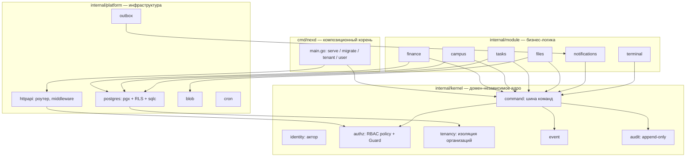
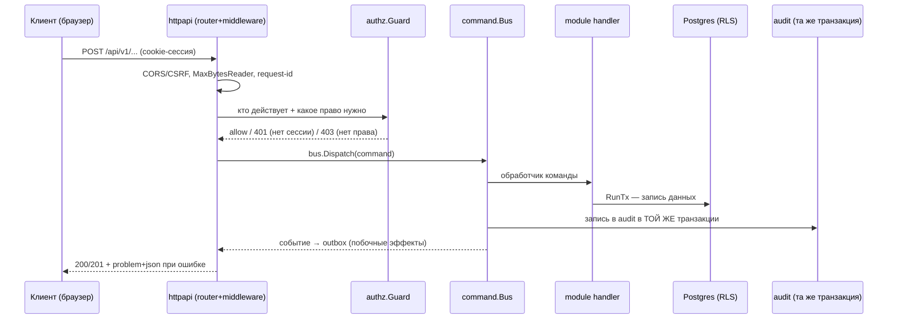

# Архитектура backend NEX (Go): обзор для обучения

Этот документ — учебная карта того, как устроен Go-бэкенд NEX: из каких
компонентов он состоит, как данные проходят через систему и почему
безопасность с оптимизацией устроены именно так. Это **синтез поверх**
существующей документации, а не замена ей:

- глубокий разбор паттернов и кода — `docs/go-guide.md`;
- обоснования конкретных решений (почему так, а не иначе) — `docs/decision-log.md` (ADR-001…021);
- как писать новый модуль — `docs/how-to-write-a-module.md`;
- команды запуска и переменные окружения — `README.md`.

Если что-то здесь разойдётся с кодом — прав код, этот документ надо поправить.

Парный документ про AI — `docs/ai/README.md`.

## 1. Общая картина в одном абзаце

NEX — **модульный монолит**: один бинарник `nexd` (`cmd/nexd/main.go`),
внутри которого домен-независимое **ядро** (kernel: identity, authz,
tenancy, шина команд/событий/аудита) хостит независимые **модули**
(finance, campus, tasks, files, notifications, terminal) с настоящей
бизнес-логикой. Зависимости смотрят только внутрь:
`cmd → module → kernel`; kernel ничего не импортирует извне, модули не
импортируют друг друга. Это осознанный выбор (ADR-001) — не то же самое,
что «просто один процесс»: главное — направление зависимостей и то, что
любое изменение данных проходит через одну и ту же шину с авторизацией и
аудитом.

## 2. Компоненты и слои

```
cmd/nexd/            Композиционный корень: собирает всё и запускает процесс
internal/config/     Конфигурация из окружения (12-factor)
internal/kernel/     Домен-независимое ядро
  identity/            Актор (кто действует)
  authz/               RBAC-политика + Guard (что актору можно)
  tenancy/             Мультитенантность (изоляция организаций)
  command/             Шина команд — единственный путь изменения данных
  event/               Доменные события (outbox-style)
  audit/               Append-only журнал аудита
internal/module/     Домен-специфичная бизнес-логика
  finance/             Двойная бухгалтерия (эталонный модуль)
  campus/               Группы, студенты, учебный журнал
  tasks/                Задачи с рассылкой и уведомлениями
  files/                Метаданные вложений (байты — в platform/blob)
  notifications/        Лента уведомлений пользователя
  terminal/             Админ-консоль ("Администратор · альфа", ADR-021)
internal/platform/   Сквозная инфраструктура (адаптеры)
  httpapi/              Роутер, middleware, problem+json, CORS, идемпотентность
  postgres/             pgx-пул, RLS-транзакции, миграции, sqlc-запросы
  blob/                 Файловое хранилище (контент-адресуемое, на диске)
  cache/                In-process TTL-кэш
  cron/                 Планировщик фоновых задач внутри процесса
  outbox/               Транзакционный outbox (надёжные побочные эффекты)
  logging/, metrics/    slog + Prometheus-экспортёр без внешних зависимостей
  textsim/               Похожесть текстов (шинглинг+MinHash) — НЕ AI, обычный алгоритм
  xlsx/                  Экспорт отчётов в XLSX
api/                  OpenAPI-контракт (openapi.yaml), встроен в бинарник
migrations/           SQL-миграции (goose), встроены в бинарник
web/                  Фронтенд-прототип (визуальный референс, не архитектура)
```

Каждый файл в `internal/` и `web/src/` дополнительно снабжён своим
`<имя>.md` с детальным разбором — это уже существующий слой
микро-документации; данный обзор — недостающий слой синтеза над ним.

## 3. Диаграмма компонентов



## 4. Поток данных: запись (write path)

Это ключевой механизм всей системы — единственный путь, которым что-либо
меняется в базе:



Важное свойство: **RBAC, аудит и транзакционность даны бесплатно любому
модулю**, который проводит мутации через шину — не нужно в каждом
хендлере вручную проверять права или писать в лог. Это же свойство
пригодится будущему AI-актору (см. `docs/ai/README.md`) — ему не
понадобится отдельный контур безопасности.

**Чтение (read path)** устроено проще и идёт в обход шины: HTTP-хендлер
→ `authz.Guard` (право `<module>:read`) → репозиторий модуля напрямую →
Postgres. Это осознанная асимметрия: чтения не меняют состояние, поэтому
не нуждаются в аудите и транзакционной обёртке шины.

## 5. Мультитенантность

Изоляция организаций — не на уровне приложения, а на уровне БД: Postgres
Row-Level Security с `FORCE ROW LEVEL SECURITY`, `tenant_id` прокидывается
через контекст транзакции (`internal/kernel/tenancy`), и это подтверждено
негативными тестами (запрос без верного tenant-контекста не должен видеть
чужие строки, даже при ошибке в коде хендлера). Слой веб-транспорта
резолвит tenant из поддомена/заголовка до входа в бизнес-логику
(`internal/platform/httpapi/tenant.go`).

## 6. Безопасность

| Слой | Механизм | Где в коде |
|---|---|---|
| Периметр | Таймауты сервера всегда (защита от Slowloris), `MaxBytesReader` + `DisallowUnknownFields` на каждом теле запроса | `internal/platform/httpapi/server.go`, `middleware.go` |
| Аутентификация | argon2id-хэши паролей, opaque-сессии (sha256-хэш токена в БД, не JWT — JWT нельзя отозвать), httpOnly+Secure cookie, скользящее продление TTL, rate limiting, выравнивание времени ответа | `internal/kernel/auth`, `internal/platform/httpapi/devauth.go` |
| Авторизация | RBAC **в шине команд**, а не в HTTP-хендлерах: каждая команда объявляет `Permission()`, `authz.Guard` проверяет до исполнения, решение (allow/deny) попадает в аудит | `internal/kernel/authz`, `internal/kernel/command/bus.go` |
| Изоляция данных | RLS с `FORCE` + tenant-scoped транзакции + негативные тесты (см. §5) | `internal/platform/postgres` |
| Аудит | Append-only журнал, запись в той же транзакции, что и мутация — нельзя потерять или рассинхронизировать | `internal/kernel/audit` |
| CSRF | Проверка `Origin` на мутациях по allowlist (= CORS origins + собственный хост) | `internal/platform/httpapi` |
| Секреты | Только из переменных окружения, никогда не логируются и не попадают в git | `internal/config` |
| Инструменты CI | `govulncheck` (уязвимости зависимостей), `gosec` через golangci-lint, `go test -race` (гонки — это баги безопасности) | `.golangci.yml`, CI |

Отдельная тема — требования 152-ФЗ (закон о персональных данных РФ):
первичное хранение ПДн студентов и сотрудников только на серверах в РФ,
append-only журнал с `trace_id` для прослеживаемости, ПДн не должны
попадать в логи (`LogValuer`). Эти требования напрямую формируют, как
можно (и как нельзя) подключать внешние AI-сервисы — подробнее в
`docs/ai/README.md`.

## 7. Оптимизация

Ключевой принцип — **stdlib-first**: прямых зависимостей всего три
(`pgx/v5`, `goose/v3`, `golang.org/x/crypto`), каждая новая — только через
ADR. Это не аскетизм ради аскетизма, а конкретные следствия:

- **Один статический бинарник.** Быстрая компиляция, простой деплой
  (multi-stage Docker → distroless), предсказуемое поведение без
  runtime-зависимостей.
- **Без внешних сервисов там, где их не нужно.** Кэш — in-process TTL
  (`internal/platform/cache`), планировщик задач — in-process
  (`internal/platform/cron`), метрики — собственный
  dependency-free Prometheus-экспортёр. Valkey/Redis запланирован только
  когда появится вторая реплика процесса (`docs/go-guide.md` §11) — не
  раньше, чем реально понадобится.
- **Типобезопасные SQL-запросы без ORM.** sqlc генерирует Go-код из SQL
  (`internal/platform/postgres/db/`) — ни рантайм-рефлексии, ни N+1 от
  ORM «из коробки», запрос виден и оптимизируется как обычный SQL.
- **Идемпотентность записи.** `Idempotency-Key` на мутациях
  (`internal/platform/httpapi/idempotency.go`) — повторный сетевой запрос
  не создаёт дубликат данных, что особенно важно при нестабильном
  соединении (проект целится в том числе в слабое железо/сеть — см.
  `docs/go-guide.md` §27, «Оптимизация под слабое железо»).
- **Транзакционный outbox** вместо синхронных вызовов сторонних систем в
  хендлере — побочный эффект (уведомление и т.п.) коммитится вместе с
  данными и доставляется отдельным воркером с ретраями, а не блокирует
  HTTP-ответ.
- **Наблюдаемость дешёвая, но полная.** `/healthz`/`/readyz`,
  структурные логи с `request_id`, метрики пула соединений
  (`pgxpool.Stat()`) — инцидент ищется по одному идентификатору без
  подключения тяжёлого APM.

## 8. Куда это ведёт: AI как ещё один актор

Терминал (`internal/module/terminal`) — единственное место в сегодняшнем
Go-коде, которое концептуально репетирует будущего AI-актора: это «ещё
один клиент шины команд» со своим правом (`terminal:exec`, только admin),
но **без единой строчки LLM-кода** — команды разбираются детерминированным
парсером (ADR-021 сознательно отклонил «исполнение свободного текста
LLM-ом на сервере»). Реальный AI сегодня целиком живёт во фронтенде и
вызывает внешние API напрямую из браузера — как это устроено и куда это
планируется перенести, см. `docs/ai/README.md`.
