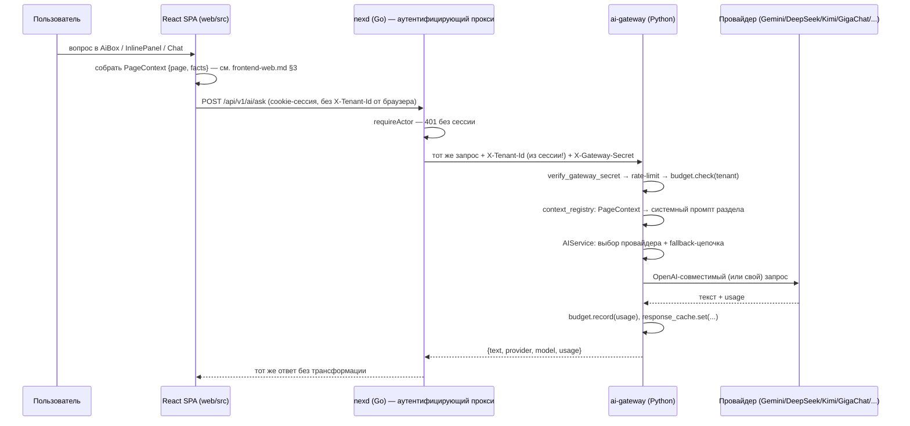

# Гид по AI-части: ai-gateway и beta/ как учебная песочница

NEX разделяет AI на два совершенно разных слоя, и первая задача этого
документа — не дать их перепутать:

| | Статус | Технология | Роль |
|---|---|---|---|
| **`ai-gateway/`** | реально работает, обслуживает фронтенд | Python/FastAPI | учебный, но полнофункциональный прод-подобный шлюз к настоящим LLM |
| **`beta/` (FrankAI, Nex-pilot)** | реально работает, но НЕ подключён к основному стеку | Python/NumPy | песочница «понять LLM изнутри», не runtime-зависимость NEX |

Оба — учебные по духу (это подчёркнуто в их README), но по-разному:
`ai-gateway` учит **инженерии вокруг** LLM (маршрутизация, бюджеты,
безопасность), `beta/FrankAI` учит **устройству** самой модели.

Читать после [`backend-go.md`](backend-go.md), §7 (AI-прокси) и
[`frontend-web.md`](frontend-web.md), §3 (мини-чат). Каноничный
источник по этой теме в репозитории — [`../ai/README.md`](../ai/README.md);
этот файл — учебный вход в неё, не замена.

## 1. Полная цепочка запроса: от клика до ответа модели



Каждое звено этой цепочки решает ровно одну проблему — учиться удобнее
именно по звеньям, а не по файлам:

1. **Зачем вообще прокси через `nexd`, а не браузер → `ai-gateway`
   напрямую?** У `ai-gateway` нет своей аутентификации — только
   заголовок `X-Tenant-Id`. Если бы браузер слал его сам, любой клиент
   мог бы вписать туда чужого тенанта и кататься на его бюджете. `nexd`
   берёт `tenant_id` из уже проверенной cookie-сессии — заголовок
   становится проверенным фактом, а не самопредставлением. Код:
   `internal/platform/httpapi/aiproxy.go` (Go) +
   `ai-gateway/app/deps.py:verify_gateway_secret` (Python) — обе
   стороны знают один секрет, `NEX_AI_GATEWAY_SECRET`.
2. **Зачем `budget.check()` ДО вызова провайдера?** Чтобы не платить
   (временем и деньгами) за запрос, который всё равно будет отклонён.
   Особенно важно для `/stream`: как только тело `StreamingResponse`
   начало отправляться, HTTP-статус 200 уже не переиграть на 429 — см.
   докстринг `ai-gateway/app/deps.py:enforce_budget`.
3. **Зачем контекст страницы — структура, а не готовый текст?** Роль
   ассистента для раздела («ты финансовый аналитик колледжа») версионируется
   в одном месте на сервере, а не размазана по JSX-файлам фронтенда.
   Код: `ai-gateway/app/core/context_registry.py`.

## 2. `ai-gateway/`: слои и куда смотреть за каждым

```
ai-gateway/app/
  main.py            Сборка FastAPI-приложения, регистрация провайдеров.
  config.py           Settings — конфиг из переменных окружения.
  deps.py              Depends: сервис, rate-limiter, тенант, budget-check,
                       verify_gateway_secret — ключевой файл для §1.
  api/
    routes.py            /api/v1/ai/{ask,stream,providers}, /healthz.
    schemas.py           Pydantic-модели, включая PageContext.
  services/
    ai_service.py         Выбор провайдера, системный промпт (+ context),
                         fallback-цепочка (_resolve_chain), запись usage.
    budget_service.py      Лимиты по тенантам: check()/record().
  providers/
    base.py               Интерфейс LLMProvider (см. код выше) — единый
                         контракт: complete()/stream().
    openai_compat.py        openai/deepseek/qwen/kimi/custom — один класс,
                         параметризованный base_url/моделью.
    gemini.py, gigachat.py, yandexgpt.py   Провайдеры со своим контрактом.
  core/
    context_registry.py    Реестр системных промптов по разделам фронтенда.
    budget_store.py         Хранилище потребления: интерфейс + in-memory.
    response_cache.py       Кэш ответов LLM: интерфейс + in-memory/Redis.
    ratelimit.py             Rate-limit: интерфейс + in-memory/Redis.
    limits.py, retry.py, request_id.py, logging.py, metrics.py
```

Заметьте повторяющийся приём: **интерфейс объявляет потребитель, не
поставщик** — тот же принцип, что в Go-ядре NEX (`docs/go-guide.md`,
§1). `LLMProvider`, `BudgetStore`, `ResponseCache`, `RateLimiter` — все
четыре сначала абстракция из пары методов, потом ровно одна
реализация по умолчанию (in-memory) и опциональная сетевая (Redis).
Понять этот приём один раз на любом из четырёх — значит понять все
четыре.

### 2.1 Провайдеры и fallback

`ai-gateway` умеет говорить с 8 провайдерами через единый интерфейс.
`openai`/`deepseek`/`qwen`/`kimi`/`custom` — все конфигурации одного
класса `OpenAICompatProvider` (они OpenAI-совместимы, разница только в
`base_url`/модели/переменной с ключом). `gigachat` и `yandexgpt` — свои
контракты (OAuth2+сертификаты РФ и Api-Key+folder_id соответственно), с
мок-режимом (`GIGACHAT_MOCK`/`YANDEXGPT_MOCK`) для дев-стенда без
настоящих РФ-credentials. Полная таблица со статусом «проверено ли
живьём» — [`../../ai-gateway/README.md`, «Провайдеры»](../../ai-gateway/README.md#провайдеры).

Если клиент НЕ указал `provider` явно, `AIService._resolve_chain`
пробует `PROVIDER_FALLBACK_CHAIN` (по умолчанию `deepseek → kimi →
gemini`) по порядку, переключаясь на следующего при отказе (таймаут,
5xx, auth-ошибка, пустой ответ). Явный `provider` в запросе фолбэк
**отключает** — это осознанное уважение выбора клиента (в реальном
продукте так работал бы, например, принудительный ru-restricted
маршрут для ПДн, см. §5). Для `/stream` переключение провайдера
возможно только до первого отправленного клиенту чанка — часть текста
уже не «отзовёшь».

### 2.2 Бюджеты, кэш, rate-limit

- **Бюджеты** (`budget_service.py`) — токен- и cost-лимиты на сутки и
  месяц, отдельно на тенанта (`tenants.json`) или по умолчанию
  (`BUDGET_DEFAULT_*`). Проверяются `Depends(enforce_budget)` до входа
  в обработчик; учитываются `record()` сразу после успешного ответа.
  Окно (день/месяц) сбрасывается лениво — при первом обращении в новом
  окне, без таймера или фоновой задачи.
- **Кэш ответов** (`response_cache.py`) — одинаковый вопрос от одного
  тенанта к одному провайдеру не идёт к провайдеру повторно. Ключ
  обязательно включает `tenant_id` (иначе один тенант получил бы ответ,
  сгенерированный для промпта другого) и `provider` (разные провайдеры
  дают разный по стоимости ответ). Кэш-хит **не тратит бюджет** —
  `budget.record()` на кэш-хите не вызывается вовсе.
- **Rate-limit** (`ratelimit.py`) — fixed-window счётчик по IP,
  подключается только на «дорогих» эндпоинтах (`/ask`, `/stream`), не
  на `/healthz`.

Все три — за интерфейсом с in-memory реализацией по умолчанию и
опциональным Redis/Valkey-backend (`CACHE_BACKEND=redis`) для случая,
когда сервис работает не в одном процессе — тогда общая память
процесса перестаёт быть общей.

### 2.3 Что сознательно НЕ сделано (и почему это важно знать)

Это учебный сервис, не прод-система. В нём осознанно нет: RBAC (какая
роль имеет право звать AI, а не только «есть валидная сессия») и
аудита конкретных вопросов внутри самого `ai-gateway` — в реальном NEX
это дал бы command bus (см. `backend-go.md`, §4, и §5 ниже); нет
анонимизации ПДн и ru-restricted маршрута, которые в реальном продукте
требует 152-ФЗ (см. `../ai/README.md`, §3). Если хочется практики
именно на этом — это открытая задача поверх готового шлюза, а не баг.

## 3. Запуск и первый эксперимент

```sh
cd ai-gateway
python -m venv .venv && source .venv/bin/activate   # Windows: .venv\Scripts\Activate.ps1
pip install -r requirements.txt
cp .env.example .env   # впишите хотя бы один ключ, или включите GIGACHAT_MOCK=true
uvicorn app.main:app --reload --port 8090
```

```sh
curl -s http://localhost:8090/api/v1/ai/ask \
  -H "Content-Type: application/json" \
  -d '{"message": "Объясни в двух предложениях, что такое RBAC"}'
```

Дальше стоит вручную воспроизвести три показательных сценария (все
описаны с готовыми `curl`-примерами в
[`../../ai-gateway/README.md`](../../ai-gateway/README.md)):
исчерпание бюджета (`BUDGET_DEFAULT_DAILY_TOKENS=50` в `.env` — увидеть
429 через пару запросов), кэш-хит (одинаковый вопрос дважды подряд —
второй ответ мгновенный, в логах вместо `budget:` запись про
`cache hit`), стриминг (`curl -N .../stream` — увидеть события `event:
delta`/`event: usage` по мере поступления).

## 4. `beta/`: собственная модель и ассистент с нуля

`beta/` — два связанных подпроекта, **не часть runtime-стека NEX**
(явно исключены из `compose.yaml`) и не подключены к `ai-gateway`
физически:

```
FrankAI  →  единый интерфейс Engine.generate()  →  Nex-pilot
                                                       │
                                     (опционально, вместо FrankAI)
                                                       ▼
                                                  ai-gateway → настоящий LLM
```

**`beta/FrankAI`** — символьная (char-level) рекуррентная сеть (vanilla
RNN) на чистом NumPy, обучаемая обратным распространением ошибки во
времени (BPTT) на нескольких килобайтах текста. Цель — увидеть весь
путь языковой модели целиком: `frankai/tokenizer.py` (буква ↔ число,
без BPE) → `frankai/model.py` (`CharRNN`: forward, backward, обрезка
градиентов, Adagrad — всё явно, без autograd-фреймворка) →
`frankai/engine.py` (`FrankAI.generate()/train()/save()/load()`).
**Честно предупреждение из его README:** результат генерации не будет
связным текстом — корпус на много порядков меньше, чем у настоящих
LLM, сеть маленькая и без attention. Это не баг, а суть — весь код
умещается в три файла и читается целиком за один присест.

**`beta/Nex-pilot`** — тонкий слой оркестрации поверх любого движка,
реализующего `Engine.generate()`: промпт-шаблон (`prompts.py`) + память
диалога в процессе (`memory.py`, последние N реплик) + CLI (`cli.py`).
Два backend'а на выбор (`nexpilot/backends/`):

| Backend | Что вызывает | Нужна сеть? | Качество |
|---|---|---|---|
| `frankai` (по умолчанию) | Локальный `FrankAI.generate()` | нет | учебное, см. предупреждение выше |
| `gateway` | Уже готовый `ai-gateway` → настоящий провайдер | да | настоящий LLM-ответ |

Оба backend'а реализуют один и тот же интерфейс
`Backend.generate(prompt) -> str` — тот же приём «интерфейс = контракт
между слоями», что и `LLMProvider` в `ai-gateway` и `Engine` в
`FrankAI`. Увидеть все три реализации этого приёма подряд
(`frankai/engine.py:Engine`, `Nex-pilot/nexpilot/backends/base.py:Backend`,
`ai-gateway/app/providers/base.py:LLMProvider`) — короткое и полезное
упражнение на то, что архитектурные приёмы переживают смену языка и
масштаба задачи.

```sh
cd beta/Nex-pilot
python -m venv .venv && source .venv/bin/activate
pip install -r requirements.txt   # ставит FrankAI editable-пакетом из ../FrankAI
python -m nexpilot.cli            # REPL, backend=frankai по умолчанию
python -m nexpilot.cli --backend gateway   # нужен запущенный ai-gateway
```

`GatewayBackend` — единственный клиент `ai-gateway` в репозитории,
который ходит в шлюз НАПРЯМУЮ, минуя `nexd` (это CLI-утилита, не
браузер): он сам подписывает запрос тем же `X-Gateway-Secret`, если
секрет настроен. Полезно сравнить с §1 — это второй, более простой
пример того же правила доверия («серверный клиент подписывает секретом
там, где браузер этого сделать не может»).

## 5. Куда это движется: план Go-нативного AI (не реализовано)

Всё в этом разделе — **план**, не код. `docs/ai/README.md`, §2
описывает целевую архитектуру: AI как актор шины команд Go
(`bus.Dispatch` от актора `ai:*`, ограниченного той же RBAC-политикой,
что и люди — см. `backend-go.md`, §4), с планируемым пакетом
`internal/platform/llm` (цепочка декораторов `Router → Budget → Cache →
RateLimit → Fallback`, зеркалящая то, что `ai-gateway` уже делает
условными ветками на Python). Сегодняшний `ai-gateway` — рабочий
прототип части этой архитектуры, не финальное решение: он не
интегрирован с command bus, RBAC `ai:*` и аудитом Go-ядра. Единственное
место в Go-коде, которое уже репетирует форму будущего AI-актора —
`internal/module/terminal` (см. `backend-go.md`, §7).

## 6. Что читать дальше

- Полный и самый точный источник по этой теме, включая историю
  изменений архитектуры и правовые оговорки по 152-ФЗ —
  [`../ai/README.md`](../ai/README.md).
- Как это выглядит с фронтенда (три точки входа, `PageContext`,
  сессии) — [`frontend-web.md`](frontend-web.md), §3.
- Как поднять весь стек локально одной командой —
  [`getting-started.md`](getting-started.md).
- Как безопасно и осознанно спрашивать ИИ про незнакомый код (в том
  числе про этот AI-стек) — [`how-to-read-and-learn.md`](how-to-read-and-learn.md), раздел «ИИ как инструмент».
