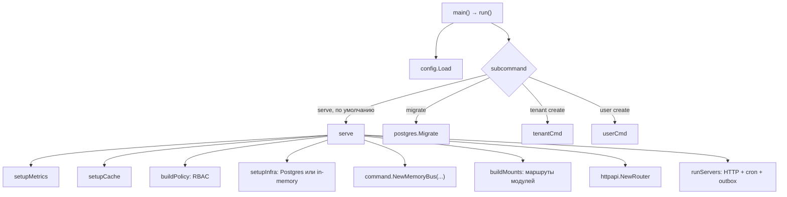
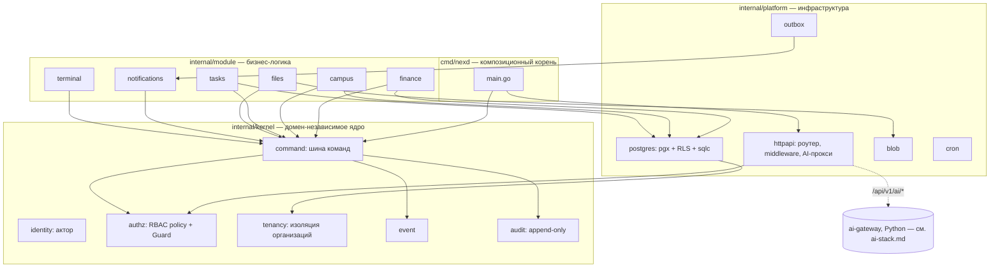
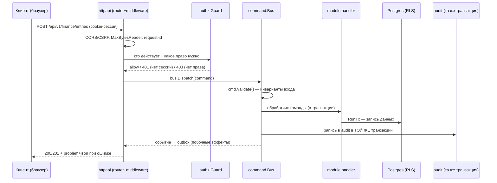
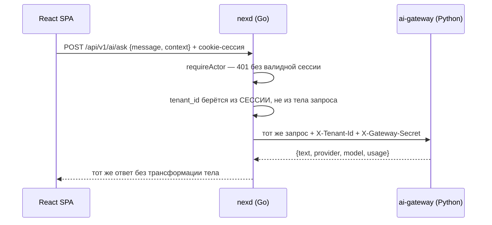

# Гид по бэкенду (Go/nexd): архитектура сверху вниз

Это учебный документ уровня «прочитал — понял, как устроен весь бэкенд».
Он не заменяет существующую документацию, а даёт маршрут по ней:

- за деталями каждого решения («почему pgx, а не GORM») — идите в
  [`../decision-log.md`](../decision-log.md) (ADR-001…021);
- за инженерным разбором паттернов Go в этом проекте — в
  [`../go-guide.md`](../go-guide.md);
- за синтезом архитектуры (уже готовым, того же типа, что этот файл, но
  плотнее и без учебных отступлений) — в [`../architecture-go.md`](../architecture-go.md);
- за шаблоном «как написать новый модуль» — в
  [`../how-to-write-a-module.md`](../how-to-write-a-module.md).

Этот файл — «войти и не утонуть»: минимум предварительных знаний,
максимум связок «концепция → конкретный файл».

Читать после: [`getting-started.md`](getting-started.md) (проект уже
запущен и отвечает на `curl http://localhost:8080/healthz`). Читать до:
[`ai-stack.md`](ai-stack.md) (AI-прокси — последняя тема этого файла, §7).
Главный ориентир по всему учебному циклу — [`README.md`](README.md) и
[`how-to-read-and-learn.md`](how-to-read-and-learn.md).

## 0. Что это за система в одном абзаце

NEX — модульный монолит: один бинарник `nexd`, который хостит
домен-независимое **ядро** (identity, authz, tenancy, шина
команд/событий/аудита) и набор независимых **модулей** (finance, campus,
tasks, files, notifications, terminal). Зависимости смотрят только
внутрь: `cmd → module → kernel`. Целевая среда — колледж с одним
админом на VPS за 20-50 $/мес, а не облачный кластер, — это объясняет
почти все архитектурные решения ниже: stdlib вместо фреймворков,
Postgres вместо зоопарка сервисов, один процесс вместо микросервисов.

## 1. Карта кода — что за что отвечает

```
cmd/nexd/main.go        Композиционный корень: единственное место, где всё
                         собирается вместе (см. §2 ниже). Точка входа для чтения.

internal/config/        Конфигурация из переменных окружения (12-factor).

internal/kernel/        Домен-независимое ядро — НЕ знает про finance/campus/etc.
  identity/                Actor (кто действует) — тип + функции работы с context.Context.
  tenancy/                 TenantID в context.Context — изоляция организаций.
  authz/                   RBAC: Policy (роль → право), Guard (HTTP-хелпер),
                           PolicyAuthorizer (проверка для шины команд).
  auth/                    Аутентификация: argon2id-пароли, сервис сессий,
                           интерфейс Store (реализуется в platform/postgres).
  command/                 Шина команд: Command-интерфейс, Bus.Dispatch,
                           TxRunner-интерфейс, Authorizer-интерфейс.
  event/                   Доменные события: контракт Name()/OccurredAt().
  audit/                   Append-only журнал: Recorder-интерфейс,
                           SlogRecorder (in-memory режим).

internal/module/        Домен-специфичная бизнес-логика. Каждый модуль
                         зависит ТОЛЬКО от kernel/platform, никогда от
                         другого модуля (см. §5).
  finance/                 Двойная бухгалтерия — ЭТАЛОННЫЙ модуль,
                           смотрите его первым, когда пишете новый.
  campus/                  Группы, студенты, учебный журнал.
  tasks/                   Задачи с рассылкой и уведомлениями.
  files/                   Метаданные вложений (сами байты — в platform/blob).
  notifications/           Лента уведомлений пользователя.
  terminal/                Админ-консоль «Администратор · альфа» (ADR-021) —
                           репетиция формы будущего AI-актора, см. §7.

internal/platform/      Сквозная инфраструктура — адаптеры, не бизнес-логика.
  httpapi/                 Роутер, middleware, auth-эндпоинты, problem+json,
                           AI-прокси (aiproxy.go, см. §7).
  postgres/                pgx-пул, RLS-транзакции (tx.go), goose-миграции,
                           sqlc-код (db/), Store'ы (authstore.go и т.п.).
  blob/                    Файловое хранилище на диске (content-addressed).
  cache/                   In-process TTL-кэш + опциональный Redis/Valkey-backend.
  cron/                    Планировщик фоновых задач внутри процесса.
  outbox/                  Транзакционный outbox — надёжные побочные эффекты.
  logging/, metrics/       slog-конструктор + dependency-free Prometheus-экспортёр.
  textsim/                 Похожесть текстов (шинглинг+MinHash) — обычный
                           алгоритм, НЕ AI (легко перепутать по названию).
  xlsx/                    Экспорт отчётов в XLSX.

api/openapi.yaml         Контракт API, embed в бинарник (api/embed.go).
migrations/*.sql          SQL-миграции (goose), embed в бинарник.
```

**Правило навигации**: почти каждый Go-файл и файл `web/src/` уже несёт
свой `<имя>.md` рядом — микро-документация по конкретному файлу. Этот
гид — недостающий слой над ней: связывает файлы в общую картину. Если
нужны детали конкретного файла — открывайте его `.md`-пару, не гадайте
по имени.

## 2. Входная точка: `cmd/nexd/main.go`

Начните чтение бэкенда именно отсюда — это **композиционный корень**:
единственное место, где конкретные реализации (Postgres или in-memory,
какие модули подключены, какие права у каких ролей) собираются вместе.
Ничего не спрятано за DI-контейнером или `init()`-магией — всё видно
последовательным чтением `run() → serve() → setupInfra()/buildMounts()`.



Ключевая деталь для новичка: `serve()` в файле — это буквально
«оглавление», а не код с логикой. Логика каждого шага вынесена в
отдельные функции (`setupMetrics`, `setupCache`, `buildPolicy`,
`setupInfra`, `buildMounts`, `runServers`) — читайте `serve()` целиком
первым, чтобы понять последовательность, а вглубь каждой функции
заходите по необходимости.

**Что можно пока пропустить при первом чтении:** `tenantCmd`/`userCmd`
(это bootstrap-утилиты для CLI, не часть HTTP-пути) и `sameSiteMode`/
`taskNotifier` (мелкие адаптеры на несколько строк).

## 3. Компоненты и как они связаны



## 4. Поток данных: запись (write path)

Это единственный путь, которым в NEX вообще меняются данные — понять
его важнее, чем прочитать любой отдельный модуль.



Прочитайте эту цепочку на живом примере: `internal/module/finance/http.go`
(парсинг HTTP → сборка команды) → `internal/module/finance/commands.go`
(`PostEntry.Validate()` — главный доменный инвариант «дебет = кредит») →
`internal/kernel/command/bus.go` (`Dispatch`) →
`internal/module/finance/handlers.go` (сам хендлер) →
`internal/module/finance/pgrepo.go` (запись в Postgres).

**Почему это устроено именно так.** RBAC, аудит и транзакционность
достаются бесплатно любому модулю, который проводит мутации через шину
— не нужно в каждом HTTP-хендлере вручную проверять права или писать в
журнал. Это же свойство планируется использовать для будущего
AI-актора (§7 и `ai-stack.md`) — ему не понадобится отдельный контур
безопасности, только права `ai:*` в той же политике.

**Чтение (read path) устроено проще и идёт в обход шины:**
HTTP-хендлер → `authz.Guard` (право `<module>:read`) → репозиторий
модуля напрямую → Postgres. Чтения не меняют состояние, поэтому не
нуждаются в аудите и транзакционной обёртке шины — это осознанная
асимметрия, а не недосмотр.

## 5. Мультитенантность: от заголовка до строки таблицы

Изоляция колледжей друг от друга — не на уровне Go-кода («не забыть
добавить `WHERE tenant_id = ...`»), а на уровне СУБД: Postgres
Row-Level Security. Путь tenant'а через систему:

```
запрос → sessionIdentity (tenant из сессии) или X-Dev-Tenant (dev)
       → tenantResolver: slug → UUID по реестру tenants
       → контекст запроса (tenancy.WithTenant)
       → InTenantTx: транзакция с app.tenant_id
       → RLS-политики Postgres отсекают чужие строки
```

Что важно понять, а не просто запомнить:

- **`FORCE ROW LEVEL SECURITY`** обязателен — без него владелец таблиц
  (которым обычно подключается приложение) молча обходит свои же
  политики. Это первая типовая ошибка при добавлении RLS-таблицы.
- **`NULLIF(current_setting('app.tenant_id', true), '')::uuid`** — так
  политика превращает «tenant не установлен» в «ноль строк», а не в
  ошибку каста. «Забыли установить tenant» деградирует в «пусто», а не
  в 500 — это осознанный выбор безопасности (fail closed).
- **В самих SQL-запросах фильтра по `tenant_id` нет.** Граница
  проводится один раз в политике — так её нельзя забыть в одном из
  десятка SELECT'ов.

Живой код: `internal/platform/postgres/tx.go` (`InTenantTx`),
миграция `migrations/00002_finance.sql` (пример RLS-политики на
реальной таблице), негативные тесты в
`internal/platform/postgres/postgres_test.go` (чужой tenant физически
не видит и не может записать чужие строки — это не деталь, это то, что
делает мультитенантность настоящей, а не заявленной).

## 6. Аутентификация — что происходит при логине

`POST /api/v1/auth/login {"tenant", "email", "password"}` → пароль
проверяется argon2id (`internal/kernel/auth/password.go`) →
создаётся opaque-токен (256 бит из `crypto/rand`) → клиенту уходит
httpOnly cookie `nex_session`, в БД хранится только sha256-хэш токена.
Дальше на каждый запрос `sessionIdentity`-middleware превращает
валидную cookie в `identity.Actor` + `tenancy.TenantID` в контексте —
и это то, что видит вся остальная система (шина команд, authz).

Три детали, которые стоит запомнить именно потому, что они
контринтуитивны:

1. **Одна и та же ошибка на все причины отказа входа** («нет
   пользователя» и «неверный пароль» неотличимы для клиента) — так
   ответ не раскрывает, какая часть пары была неверна.
2. **argon2 всё равно прогоняется**, даже если пользователь не найден
   (сверка с фиктивным хэшем) — иначе время ответа выдавало бы,
   существует ли email, через тайминг-атаку.
3. **Таблица `sessions` — единственная без RLS.** Сессию ищут по
   хэшу токена ДО того, как tenant известен — значит, на этом шаге
   ещё нечем ограничить строки политикой. Компенсация: токен всё равно
   захэширован, а сама таблица не выставлена наружу никаким API.

Код: `internal/kernel/auth/` (логика), `internal/platform/postgres/authstore.go`
(хранилище), `internal/platform/httpapi/auth.go` (HTTP-эндпоинты).
Подробный разбор — `../go-guide.md`, §9.

## 7. Прокси к ai-gateway — где Go заканчивается и начинается Python

`nexd` не вызывает ни одну LLM сам — он аутентифицирующий прокси перед
отдельным Python-сервисом `ai-gateway/`. Это единственное место в
Go-коде, которое явно знает про AI:



Код: `internal/platform/httpapi/aiproxy.go`. Смысл существования этого
файла — не дать браузеру самому подделать `X-Tenant-Id` (иначе любой
клиент мог бы вписать чужого tenant'а и кататься на его AI-бюджете).
`nexd` берёт `tenant_id` из уже проверенной сессии и подписывает
исходящий запрос секретом (`NEX_AI_GATEWAY_SECRET`), общим с
`ai-gateway`. Пустое `NEX_AI_GATEWAY_URL` означает, что прокси вообще
не монтируется — `/api/v1/ai/*` просто не появляется как маршрут.

Терминал (`internal/module/terminal`) стоит прочитать сразу после этого
раздела — это ЕДИНСТВЕННОЕ место в сегодняшнем Go-коде, которое
концептуально репетирует форму будущего AI-актора (ещё один клиент
шины команд со своим правом `terminal:exec`), но при этом **не
содержит ни строчки LLM-кода** — команды разбирает детерминированный
парсер (`strings.Fields` + alias-таблица), а свободный текст уходит во
фронтенд, который уже сам решает, звать ли AI. Это сознательное
решение (ADR-021) — сервер не исполняет свободный текст от LLM.

Продолжение этой темы — куда AI встроится по-настоящему (актор `ai:*`,
`internal/platform/llm`, function calling через команды шины) — в
[`ai-stack.md`](ai-stack.md) и в `../ai/README.md`.

## 8. Что читать дальше

- Хотите написать свой модуль — `../how-to-write-a-module.md` +
  прочитайте `internal/module/finance` целиком как эталон (порядок
  файлов: `doc.go` → `ledger.go` → `commands.go` → `handlers.go` →
  `repo.go` → `pgrepo.go`/`memrepo.go` → `http.go`).
- Хотите понять конкретное архитектурное решение («почему не
  микросервисы», «почему нет ORM») — `../decision-log.md`.
- Хотите производительность/бюджеты железа/масштабирование —
  `../go-guide.md`, §22-27.
- Хотите фронтенд, который вызывает всё это, — [`frontend-web.md`](frontend-web.md).
