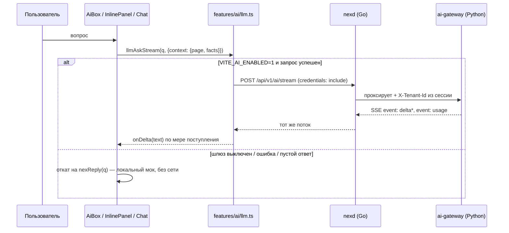

# Гид по фронтенду (web/): структура, роутинг, мини-чат и связь с бэкендом

`web/` — визуальный прототип «КИС Колледж» на React 19 + TypeScript +
Vite. По `../roadmap.md` (веха M7) он в перспективе будет заменён
приложением на TanStack Router/Query — но **сегодня в коде** роутинг
уже сделан на `wouter`, а не на TanStack Router; этот гид описывает то,
что реально работает сейчас, а не план.

Читать после [`backend-go.md`](backend-go.md) (полезно уже понимать
`/api/v1/*` и сессии) и до [`ai-stack.md`](ai-stack.md).

## 1. Карта каталогов

```
web/src/
  main.tsx            Точка входа: createRoot + <AppProvider><App /></AppProvider>.
  App.tsx             Корень приложения: Login, двухуровневая навигация,
                       Shell (десктоп) / MobileShell, карта страниц PAGES.
  ui.tsx              Глобальный контекст (AppProvider/useApp) + мелкие
                       переиспользуемые примитивы (Chip, Avatar, PageHead,
                       NexAsk, AskHero). Ядро, вокруг которого собран весь
                       фронтенд — почти каждая страница что-то отсюда берёт.
  data.ts, home.ts,    Демо-данные и конфигурация конструктора главного
  dock.tsx, blocks.tsx экрана/докбара — остались в корне сознательно
  agents.ts, campus.ts (см. §2), это не полноценные "фичи".

  api/                 Слой доступа к бэкенду nexd (см. §4).
    client.ts             apiFetch, ApiError, withFallback — основа всего.
    auth.ts, tasks.ts,     Доменные обёртки над конкретными /api/v1/* путями.
    campus.ts, agents.ts,
    terminal.ts
    index.ts              Barrel: `import { auth, tasksApi, campusApi } from '../api'`.

  components/           Переиспользуемые презентационные примитивы без
                        завязки на состояние приложения.
    charts.tsx             Графики (без сторонних чарт-библиотек, см. .md).
    md.tsx                 Рендерер markdown-ответов ИИ (Md).

  features/             Связные кластеры функциональности ("вертикальные срезы").
    ai/                    "Мозг" NEX — см. §3.
      ai.tsx                 ProactiveStrip, InlinePanel, SelectionPopover, AiLayer.
      llm.ts                 Единая точка входа к ai-gateway (через nexd).
      nexbrain.ts            Локальный детерминированный мок-движок (демо-режим).
      nexdata.tsx            Рендер структурированных data-блоков в ответах.
      stream.tsx             UI для потокового (SSE) ответа.
    terminal/
      terminal.tsx           Админ-консоль «Администратор · альфа» (845 строк —
                             самый большой файл проекта).

  pages/                 Экраны разделов — по одному (или несколько
                        именованных экспортов) на файл, почти все грузятся
                        лениво через React.lazy (см. §2).
  beta/                  Локальный слой "беты": CRUD-таблицы поверх
                        localStorage (`useCollection`), пока бэкенд-модули
                        не реализованы, см. `../../backend.md`.
  test/setup.ts          Настройка Vitest (jsdom).
```

**Правило навигации, как и в бэкенде:** у каждого файла есть свой
`<имя>.md` рядом (например, `App.md`, `ui.md`, `features/ai/ai.md`) —
подробный разбор именно этого файла: ключевые экспорты, как это
работает, связи, на что обратить внимание. Открывайте `.md`, когда
нужны детали конкретного модуля — этот гид даёт только карту связей
между ними.

## 2. Как устроена навигация и code splitting

Роутинг — **`wouter`** (не TanStack Router, вопреки более раннему
плану в `../tech-stack.md` — код разошёлся с тем документом; верить
коду). Прочитайте связку `ui.tsx` + `App.tsx`, чтобы понять модель:

- `useApp().page` — не обычный `useState`, а производная от
  `wouter`-хука `useLocation()`: `page = location.replace(/^\//, '') || 'home'`.
  `setPage(id)` вызывает `navigate('/' + id)`. Это даёт настоящий
  deep-linking (URL раздела можно скопировать и открыть заново) без
  изменения контракта `useApp().page`/`setPage` для остального кода —
  ни одна страница не знает, что под капотом роутер вообще есть.
- `App.tsx: SECTIONS` — дерево навигации (раздел → подстраницы),
  чистые данные (`id`/`label`/`icon`), без React-узлов.
- `App.tsx: PAGES` — карта `id подстраницы → ComponentType`, почти
  целиком собранная через `React.lazy`. Код каждого раздела
  подгружается отдельным чанком **только при первом переходе в него**,
  а не одним куском в главный бандл.
- `lazyOf(loader, exportName)` — маленький адаптер: не все файлы в
  `pages/` имеют `default export`, некоторые экспортируют несколько
  именованных компонентов из одного файла (например,
  `finance-beta.tsx` отдаёт и `FinInvoices`, и `FinVat`, и `FinActs`) —
  несколько записей `PAGES`, указывающих на один файл, попадают в один
  и тот же чанк (Rollup дедуплицирует по модулю, не по записи карты).

```mermaid
graph LR
    U[Пользователь кликает раздел] --> SP[setPage id]
    SP --> NAV["wouter: navigate('/' + id)"]
    NAV --> LOC[useLocation меняется]
    LOC --> PAGE["useApp().page обновился"]
    PAGE --> RS["renderSub(id) в App.tsx"]
    RS --> LOOKUP["PAGES[id] — React.lazy(() => import(...))"]
    LOOKUP --> CHUNK[Отдельный JS-чанк подгружается по сети]
    CHUNK --> RENDER["<Suspense fallback={null}><Comp /></Suspense>"]
```



**Что можно пропустить при первом чтении `App.tsx`:** список
`AI_ACTIONS` внутри `NexOmni()` — это просто данные для омнибокса
(Cmd/Ctrl+K), а не логика; `MobileShell()` можно прочитать бегло — она
почти зеркальна `Shell()`, только с нижним докбаром вместо боковой
панели.

## 3. Мини-чат и работа с ai-gateway через nexd

Это самая важная тема для понимания «AI-native» части UI — три слоя,
снизу вверх:

1. **`features/ai/llm.ts`** — единственный файл, который реально ходит
   в сеть за ответом ИИ. Экспортирует `llmAsk()` (обычный запрос),
   `llmAskStream()` (SSE-стриминг), `fetchProviders()`,
   `checkGateway()`. Все запросы идут на `${API_BASE}/api/v1/ai/*` —
   тот же origin и та же cookie-сессия, что и весь остальной API (см.
   `api/client.ts`), **не** на прямой URL `ai-gateway` — фронтенд его
   вообще не знает. Включается флагом `VITE_AI_ENABLED` (не URL'ом).
2. **`features/ai/nexbrain.ts`** — локальный детерминированный
   мок-движок (`nexReply()`, `planFor()`, `pageInsight()`) — то, что
   отвечает пользователю, когда ИИ выключен или запрос не удался.
3. **Точки входа UI** — три независимых места, каждое реализует один и
   тот же трёхуровневый фолбэк `llmAskStream → llmAsk → nexReply`:

| Файл | Компонент | Стриминг | Память диалога |
|---|---|---|---|
| `pages/Chat.tsx` | `Chat` — полноэкранный чат, явный `system: ORG_CONTEXT` | да | глобальная (`useApp().chatLog`) |
| `pages/aibox.tsx` | `AiBox` — переиспользуемый мини-чат для раздела, передаёт `context: {page, facts}` | да | `sessionStorage`, ключ `nex-ai-hist:<page>` |
| `features/ai/ai.tsx` | `InlinePanel` — чат, открывающийся прямо в потоке страницы под кликнутым блоком | да | `sessionStorage`, ключ `nex-ai-inline-hist:<page или student:id>` |



**Контекст страницы — структура, а не текст.** Раньше каждая страница
сама вписывала роль ассистента строкой прямо в JSX («Ты — финансовый
аналитик...»). Теперь `AiBox`/`InlinePanel` шлют `PageContext`
(`{ page: 'finance', title, facts: ['Задолженность 248000 ₽', ...] }`)
— сервер (`ai-gateway/app/core/context_registry.py`) сам превращает
`page` в системную инструкцию. Подробности серверной стороны —
[`ai-stack.md`](ai-stack.md).

## 4. Как фронтенд говорит с бэкендом (не только ИИ)

`api/client.ts` — основа всего слоя `api/`:

- `apiFetch<T>(path, init)` — низкоуровневый запрос: всегда
  `credentials: 'include'` (cookie-сессия), разбирает ошибки в формате
  RFC 9457 в `ApiError` (`status`/`title`/`detail`).
- `withFallback(call, mock)` — обёртка **только для чтений**: если
  бэкенд не сконфигурирован (`VITE_API_URL` пуст) или запрос упал —
  тихо возвращает мок, экран продолжает работать. Мутации (login,
  create, delete) этот фолбэк **намеренно не используют** — их
  результат обязан отражать настоящий ответ сервера, а не соврать
  успехом, которого не было.
- `API_CONFIGURED` — вычисляется из `VITE_API_URL` на этапе загрузки
  модуля: пусто → демо-режим целиком на моках, сеть не трогается.

Реально подключены к API (не моки): вход (`api/auth.ts`, сессии
`nex_session`), задачи (`api/tasks.ts`), люди → студенты/группы
(`api/campus.ts`). Остальные экраны работают на встроенных данных
(`data.ts`), но уже через тот же слой `api/` — подключение бэкенда для
них не потребует переписывать компоненты (см. `../../backend.md` —
план того, что ещё нужно на бэкенде под остальные разделы).

**Локальный dev без CORS:** `vite.config.ts` проксирует `/api/*` на
`http://localhost:8080` (переопределяется `NEX_DEV_PROXY`) — поэтому
`VITE_API_URL` можно оставить пустым при локальной разработке
«фронт+бэк на одном origin». Подробности запуска — [`getting-started.md`](getting-started.md).

## 5. Состояние приложения

Один React Context (`ui.tsx: AppProvider`/`useApp()`) на всё
приложение — никакого Redux/Zustand/TanStack Query в текущем коде
(это план `../tech-stack.md`, не факт). `AppProvider` хранит через
десяток `useState`: текущего пользователя, тему, `page` (см. §2),
открытую карточку студента, состояние командной палитры, инлайн-панель
ИИ, персонализацию интерфейса (`prefs`), лог главного чата, тосты.
Часть состояния синхронизирована с `localStorage` (тема, демо-пользователь,
`prefs` под ключом `nex-prefs`).

**Персонализация через `data-*`-атрибуты, не инлайн-стили.** `prefs`
(акцент, плотность, шрифт, скругления) применяется как `data-accent`,
`data-density` и т.п. на `<html>` — вся визуальная логика этих настроек
живёт в CSS (`index.css`), а не в JS. Полезно знать перед тем, как
менять тему/плотность программно — искать нужно в CSS-селекторах
`[data-accent="..."]`, а не в JS.

## 6. Стили

Tailwind v4 (`@import "tailwindcss"` в `index.css`) поверх
собственной дизайн-системы «Liquid Glass» — стеклянные полупрозрачные
поверхности, CSS-переменные для цветов/радиусов/теней в `:root` и
`[data-theme="dark"]`. Нет отдельной UI-библиотеки (shadcn/ui —
план `../tech-stack.md`, не текущий код) — компоненты в `ui.tsx`/`components/`
самописные, стилизованы напрямую через переменные и утилити-классы.

## 7. Тесты

Vitest + Testing Library (jsdom), конфиг — в `test`-секции
`vite.config.ts` (общий с dev-сервером). Файлы `*.test.ts(x)` лежат
рядом с исходником. Текущее покрытие — осознанно не 100%: `llm.ts`
(ask/stream/фолбэки), `api/client.ts` (`apiFetch`/`withFallback`),
`aibox.tsx` (демо-режим, стриминг, откат stream→ask→демо-мок), рендер
`components/md.tsx`. Модули, читающие `import.meta.env` при загрузке
(`llm.ts`, `api/client.ts`), тестируются через `vi.stubEnv` +
`vi.resetModules()` + динамический `import()` внутри теста — результат
не зависит от локального `web/.env` разработчика.

```sh
cd web
pnpm test          # разовый прогон — то же гоняет CI
pnpm test:watch    # watch-режим
```

## 8. Что читать дальше

- Как контекст страницы превращается в системный промпт на сервере,
  бюджеты/кэш/fallback провайдеров — [`ai-stack.md`](ai-stack.md).
- Как поднять `web` + `nexd` + `ai-gateway` вместе локально —
  [`getting-started.md`](getting-started.md).
- Что ещё нужно на бэкенде, чтобы разделы `beta/*` перестали писать в
  `localStorage` — `../../backend.md`.
